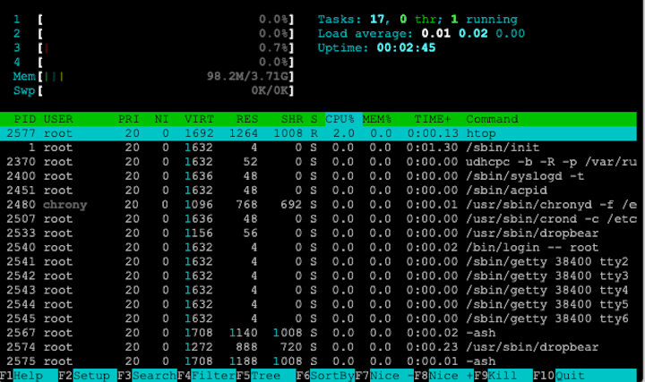

# ALPINOS


### A Raspberry Pi 4 distro based on Alpine Linux



Nothing special. Just a proof of concept. My goals are:

* Lightweight distribution based on *Alpine Linux*.

* Target: Raspberry Pi 4

* Scripts ready to install environments: desktop, retro games, development.

### How to use

* Burn with your favorite app.

* user: root, password: 1234

* Configure with ``` alpine-setup ```

* This OS is volatile. If you want to commit your changes, just type ``` lbu commit ```

* You should not use only root user, but If you do, type the next: ``` lbu add /root ```

* For get ready with some essential tasks, just type the next:

```bash
wget -qO- https://git.io/Jfe2R | ash
```

* You have some interesting scripts inside /scripts dir. Improve then and make a PR!. 💪🏻

## TODO

* Set the display to run app that requires *DISPLAY*. 🤷‍♂️

MIT License

